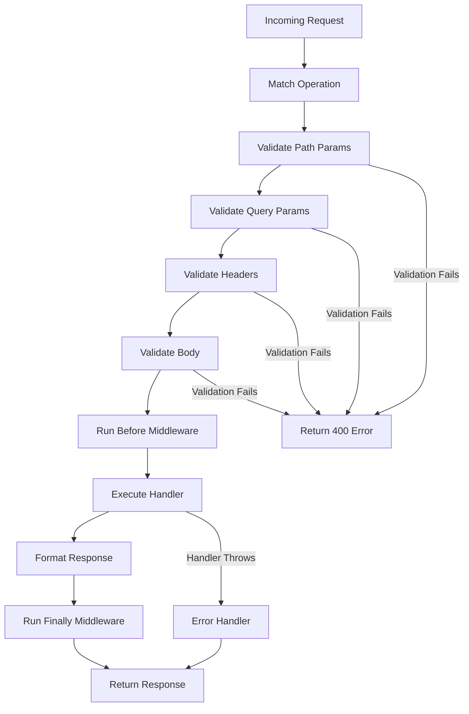
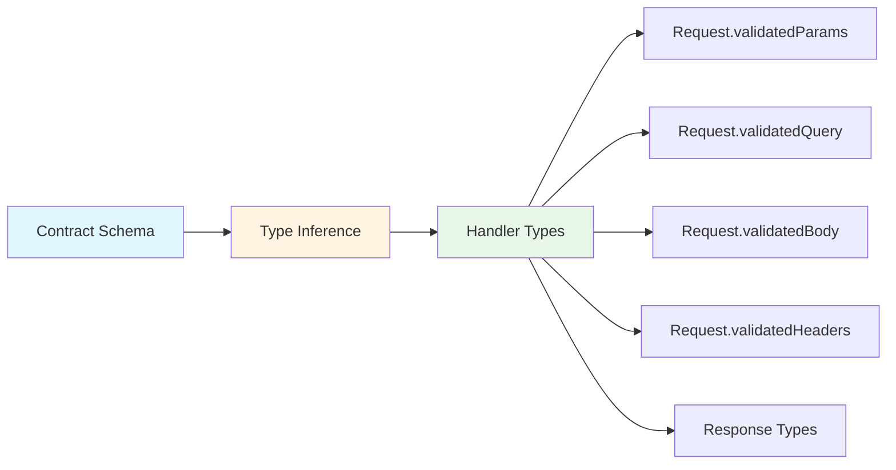

# Core Concepts

This guide explains the fundamental concepts behind `itty-spec` and how they work together to provide type-safe, contract-first API development.

## Contract

A contract is a plain object describing each operation in your API. It serves as the single source of truth for both runtime behavior and compile-time types.

### Contract Structure

Each operation in a contract defines:

* `method` and `path` - HTTP method and route pattern
* `pathParams` (optional) - Schema for path parameters (e.g., `/users/:id`)
* `query` (optional) - Schema for query string parameters
* `headers` (optional) - Schema for request headers
* `requests` (optional) - Request body schemas keyed by content type
* `responses` - Response schemas keyed by status code and content type
* Metadata (optional) - `summary`, `description`, `tags`, `operationId`

### Example Contract

```ts
import { createContract } from "itty-spec";
import { z } from "zod";

export const contract = createContract({
  getUser: {
    path: "/users/:id",
    method: "GET",
    pathParams: z.object({ id: z.string().uuid() }),
    headers: z.object({
      authorization: z.string(),
    }),
    responses: {
      200: {
        "application/json": {
          body: z.object({
            id: z.string().uuid(),
            name: z.string(),
            email: z.string().email(),
          }),
        },
      },
      404: {
        "application/json": {
          body: z.object({ error: z.string() }),
        },
      },
    },
  },
});
```

### Contract Benefits

The contract drives both:
- **Runtime behavior**: Automatic validation, routing, and response formatting
- **Compile-time types**: Full TypeScript inference from contract to handler

## Router

`createRouter({ contract, handlers })` binds your handlers to the contract and produces a Fetch handler (`router.fetch`).

### Router Lifecycle

Here's what happens when a request comes in:



### Request Flow

1. **Operation Matching**: The router finds the matching operation based on HTTP method and path pattern
2. **Validation**: All request parts (params, query, headers, body) are validated against schemas
3. **Handler Execution**: Your handler receives typed, validated data
4. **Response Formatting**: The response is validated against the contract and formatted

### Example Router

```ts
import { createRouter } from "itty-spec";
import { contract } from "./contract";

const router = createRouter({
  contract,
  handlers: {
    getUser: async (request) => {
      // All data is typed and validated!
      const { id } = request.validatedParams; // { id: string }
      const authHeader = request.validatedHeaders.get("authorization"); // string | null
      
      // Your business logic here
      const user = await getUserById(id);
      
      return request.respond({
        status: 200,
        contentType: "application/json",
        body: user, // TypeScript ensures this matches the contract
      });
    },
  },
});
```

## Validation Flow

Before your handler runs, `itty-spec` validates the incoming request according to the schemas you provided. This happens automatically in the middleware chain.

### Validation Order

1. **Path Parameters**: Extracted from URL and validated
2. **Query Parameters**: Parsed from URL and validated
3. **Headers**: Normalized (lowercase) and validated
4. **Body**: Parsed based on Content-Type and validated

### Validation Errors

If validation fails, the request is rejected with a 400 status code and detailed error information:

```json
{
  "error": "Validation failed",
  "details": [
    {
      "path": ["email"],
      "message": "Invalid email"
    }
  ]
}
```

## Type Inference

`itty-spec` provides end-to-end type safety through TypeScript inference. Types flow from your contract schemas directly to your handlers.

### Type Flow



### Example Type Inference

```ts
// Contract defines the types
const contract = createContract({
  createUser: {
    path: "/users",
    method: "POST",
    requests: {
      "application/json": {
        body: z.object({
          name: z.string(),
          email: z.string().email(),
        }),
      },
    },
    responses: {
      201: {
        "application/json": {
          body: z.object({ id: z.string(), name: z.string() }),
        },
      },
    },
  },
});

// Handler receives inferred types
const handler = async (request: ContractRequest<typeof contract.createUser>) => {
  // TypeScript knows the exact shape!
  const { name, email } = request.validatedBody; // { name: string; email: string }
  
  // TypeScript ensures response matches contract
  return request.respond({
    status: 201,
    contentType: "application/json",
    body: { id: "123", name }, // ✅ Type-safe!
    // body: { name } // ❌ Error: missing 'id'
  });
};
```

## Responses

Handlers return responses via `request.respond({ status, contentType, body })`.

### Response Validation

The shape of your response is type-checked against the contract for the current operation. Returning the wrong status code, content type, or body shape becomes a TypeScript error at compile time.

### Multiple Response Types

You can define multiple response variants per operation:

```ts
responses: {
  200: {
    "application/json": { body: SuccessSchema },
    "text/html": { body: z.string() },
  },
  400: {
    "application/json": { body: ErrorSchema },
  },
}
```

### Response Headers

You can also define response headers in your contract:

```ts
responses: {
  201: {
    "application/json": {
      body: UserSchema,
      headers: z.object({
        location: z.string().url(),
      }),
    },
  },
}
```

## Schema Support

`itty-spec` uses the [Standard Schema V1](https://github.com/standard-schema/spec) interface, which provides a common abstraction layer for schema validation. This means you can use any Standard Schema V1 compatible library:

* **Zod (v4)**: Fully supported with excellent TypeScript inference and OpenAPI generation. Recommended for the best developer experience.
* **Valibot**: Fully supported with OpenAPI generation via `@standard-community/standard-openapi`.
* **Other Standard Schema compatible libraries**: Can be used for validation; OpenAPI support depends on the library's Standard Schema V1 implementation.

The Standard Schema V1 interface ensures that your contracts remain portable across different schema libraries while maintaining type safety and runtime validation.

Learn more about [Schema Libraries](/guide/schema-libraries) and [OpenAPI Integration](/guide/openapi).

