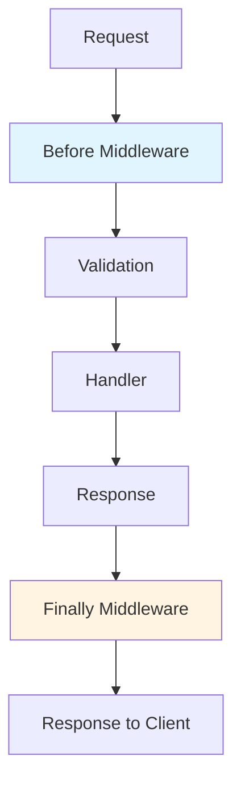

# Middleware

Middleware in `itty-spec` allows you to intercept and transform requests and responses at different stages of the request lifecycle.

## Middleware Overview

Middleware functions run at specific points in the request/response pipeline:



## Built-in Middleware

`itty-spec` includes several built-in middleware that run automatically:

### Before Middleware (Automatic)

These run in order before your handler:

1. **`withParams`** - Extracts path parameters from URL
2. **`withMatchingContractOperation`** - Finds matching operation from contract
3. **`withSpecValidation`** - Validates path params, query, headers, and body
4. **`withResponseHelpers`** - Attaches `respond()` method to request

### Finally Middleware (Automatic)

These run after your handler:

1. **`withMissingHandler`** - Handles 404 responses
2. **`withContractFormat`** - Formats responses according to contract

## Custom Middleware

### Before Middleware

Before middleware runs after validation but before your handler. Use it for:

- Authentication
- Authorization
- Logging
- Request transformation
- Rate limiting

```ts
const router = createRouter({
  contract,
  handlers,
  before: [
    // Logging middleware
    async (request) => {
      console.log(`${request.method} ${request.url}`);
      request.startTime = Date.now();
    },
    // Authentication middleware
    async (request) => {
      const auth = request.headers.get("authorization");
      if (!auth) {
        throw new Error("Unauthorized");
      }
      // Attach user info to request
      request.user = await getUserFromToken(auth);
    },
  ],
});
```

### Finally Middleware

Finally middleware runs after your handler, before the response is sent. Use it for:

- Response transformation
- CORS headers
- Response timing
- Response logging

```ts
const router = createRouter({
  contract,
  handlers,
  finally: [
    // CORS middleware
    async (request, response) => {
      response.headers.set("access-control-allow-origin", "*");
      response.headers.set("access-control-allow-methods", "GET, POST, PUT, DELETE");
      return response;
    },
    // Response timing
    async (request, response) => {
      if (request.startTime) {
        const duration = Date.now() - request.startTime;
        response.headers.set("x-response-time", `${duration}ms`);
      }
      return response;
    },
  ],
});
```

## Middleware Types

### RequestHandler

Before middleware uses the `RequestHandler` type:

```ts
type RequestHandler<RequestType extends IRequest = IRequest, Args extends any[] = any[]> = (
  request: RequestType,
  ...args: Args
) => void | Promise<void> | Response | Promise<Response>;
```

If a middleware returns a `Response`, it short-circuits the request and that response is returned immediately.

### ResponseHandler

Finally middleware uses the `ResponseHandler` type:

```ts
type ResponseHandler = (
  response: unknown,
  request: IRequest
) => Response | Promise<Response>;
```

## Common Middleware Patterns

### Authentication Middleware

```ts
async function withAuth(request: IRequest) {
  const authHeader = request.headers.get("authorization");
  
  if (!authHeader) {
    throw new Error("Missing authorization header");
  }
  
  const token = authHeader.replace("Bearer ", "");
  const user = await verifyToken(token);
  
  if (!user) {
    throw new Error("Invalid token");
  }
  
  // Attach user to request
  (request as any).user = user;
}

const router = createRouter({
  contract,
  handlers,
  before: [withAuth],
});
```

### Logging Middleware

```ts
async function withLogging(request: IRequest) {
  const startTime = Date.now();
  (request as any).startTime = startTime;
  
  console.log(`[${new Date().toISOString()}] ${request.method} ${request.url}`);
  
  // Log response in finally middleware
  return async (response: Response) => {
    const duration = Date.now() - startTime;
    console.log(`[${new Date().toISOString()}] ${request.method} ${request.url} ${response.status} ${duration}ms`);
    return response;
  };
}

const router = createRouter({
  contract,
  handlers,
  before: [withLogging],
  finally: [
    async (response, request) => {
      // Access startTime from request
      const startTime = (request as any).startTime;
      if (startTime) {
        const duration = Date.now() - startTime;
        response.headers.set("x-response-time", `${duration}ms`);
      }
      return response;
    },
  ],
});
```

### CORS Middleware

```ts
function withCORS(allowedOrigins: string[] = ["*"]) {
  return async (response: Response, request: IRequest) => {
    const origin = request.headers.get("origin");
    
    if (allowedOrigins.includes("*") || (origin && allowedOrigins.includes(origin))) {
      response.headers.set("access-control-allow-origin", origin || "*");
      response.headers.set("access-control-allow-methods", "GET, POST, PUT, DELETE, OPTIONS");
      response.headers.set("access-control-allow-headers", "Content-Type, Authorization");
      response.headers.set("access-control-max-age", "86400");
    }
    
    return response;
  };
}

const router = createRouter({
  contract,
  handlers,
  finally: [withCORS(["https://example.com"])],
});
```

### Rate Limiting Middleware

```ts
const rateLimiter = new Map<string, { count: number; resetAt: number }>();

function withRateLimit(maxRequests: number = 100, windowMs: number = 60000) {
  return async (request: IRequest) => {
    const key = request.headers.get("x-forwarded-for") || "unknown";
    const now = Date.now();
    
    const limit = rateLimiter.get(key);
    
    if (limit && limit.resetAt > now) {
      if (limit.count >= maxRequests) {
        throw new Error("Rate limit exceeded");
      }
      limit.count++;
    } else {
      rateLimiter.set(key, { count: 1, resetAt: now + windowMs });
    }
  };
}

const router = createRouter({
  contract,
  handlers,
  before: [withRateLimit(100, 60000)], // 100 requests per minute
});
```

### Request Transformation

```ts
async function withRequestTransform(request: IRequest) {
  // Transform request before handler
  if (request.method === "POST" && request.headers.get("content-type")?.includes("json")) {
    // Request body is already validated, but you can transform it
    const body = await request.json();
    (request as any).transformedBody = {
      ...body,
      createdAt: new Date().toISOString(),
    };
  }
}

const router = createRouter({
  contract,
  handlers,
  before: [withRequestTransform],
});
```

### Response Transformation

```ts
async function withResponseTransform(response: Response, request: IRequest) {
  // Transform response after handler
  if (response.headers.get("content-type")?.includes("json")) {
    const body = await response.json();
    const transformed = {
      data: body,
      meta: {
        timestamp: new Date().toISOString(),
        version: "1.0.0",
      },
    };
    return new Response(JSON.stringify(transformed), {
      status: response.status,
      headers: response.headers,
    });
  }
  return response;
}

const router = createRouter({
  contract,
  handlers,
  finally: [withResponseTransform],
});
```

## Middleware Ordering

Middleware runs in the order specified:

```ts
const router = createRouter({
  contract,
  handlers,
  before: [
    middleware1,  // Runs first
    middleware2, // Runs second
    middleware3, // Runs third
  ],
  finally: [
    middleware4, // Runs first (after handler)
    middleware5, // Runs second
  ],
});
```

### Built-in Middleware Order

Built-in middleware always runs in a specific order:

**Before:**
1. `withParams`
2. `withMatchingContractOperation`
3. `withSpecValidation`
4. `withResponseHelpers`
5. Your custom `before` middleware

**Finally:**
1. `withMissingHandler`
2. `withContractFormat`
3. Your custom `finally` middleware

## Short-Circuiting

If a before middleware returns a `Response`, it short-circuits the request:

```ts
async function withAuth(request: IRequest) {
  const auth = request.headers.get("authorization");
  if (!auth) {
    // Short-circuit: return error response immediately
    return new Response(
      JSON.stringify({ error: "Unauthorized" }),
      { status: 401 }
    );
  }
  // Continue to next middleware/handler
}

const router = createRouter({
  contract,
  handlers,
  before: [withAuth], // If this returns a Response, handler never runs
});
```

## Error Handling in Middleware

Errors thrown in middleware are caught by the error handler:

```ts
async function withAuth(request: IRequest) {
  const auth = request.headers.get("authorization");
  if (!auth) {
    throw new Error("Unauthorized"); // Caught by error handler
  }
}

// Error handler (built-in) converts to 500 response
// Or customize in router.catch
```

## Best Practices

### 1. Keep Middleware Focused

```ts
// ✅ Good - single responsibility
async function withAuth(request: IRequest) {
  // Only authentication
}

async function withLogging(request: IRequest) {
  // Only logging
}

// ❌ Bad - mixed concerns
async function withAuthAndLogging(request: IRequest) {
  // Authentication AND logging
}
```

### 2. Use TypeScript for Request Extension

```ts
interface AuthenticatedRequest extends IRequest {
  user: User;
}

async function withAuth(request: AuthenticatedRequest) {
  // TypeScript knows request.user exists
  request.user = await getUser();
}
```

### 3. Handle Errors Gracefully

```ts
async function withAuth(request: IRequest) {
  try {
    const user = await getUser();
    (request as any).user = user;
  } catch (error) {
    // Log error but don't throw
    console.error("Auth error:", error);
    // Or throw to use error handler
    throw error;
  }
}
```

### 4. Reuse Middleware

```ts
// Create reusable middleware
export const authMiddleware = async (request: IRequest) => {
  // ...
};

export const loggingMiddleware = async (request: IRequest) => {
  // ...
};

// Use in multiple routers
const router1 = createRouter({
  contract: contract1,
  handlers: handlers1,
  before: [authMiddleware, loggingMiddleware],
});

const router2 = createRouter({
  contract: contract2,
  handlers: handlers2,
  before: [authMiddleware, loggingMiddleware],
});
```

## Related Topics

- [Router Configuration](/guide/router-configuration) - Learn about router options
- [Error Handling](/guide/error-handling) - Handle errors in middleware
- [Examples](/examples/authentication) - See middleware examples

