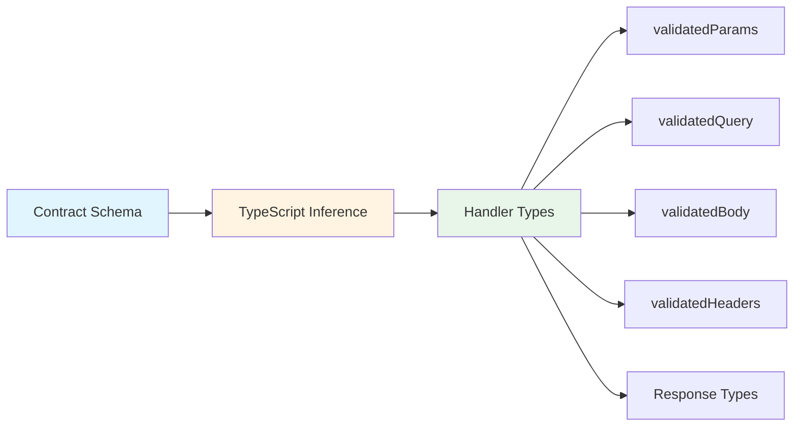

# Type Safety

`itty-spec` provides end-to-end type safety through TypeScript inference. Types flow automatically from your contract schemas to your handlers, ensuring compile-time guarantees about request and response shapes.

## Type Inference Overview

Type inference in `itty-spec` works by extracting types from your contract schemas and making them available in your handlers:



## Path Parameter Type Extraction

Path parameters are automatically extracted from path patterns and typed.

### Automatic Extraction

```ts
const contract = createContract({
  getUser: {
    path: "/users/:id",  // Automatically typed as { id: string }
    method: "GET",
    responses: { /* ... */ },
  },
});

// In handler:
const { id } = request.validatedParams; // Type: { id: string }
```

### Using `as const` for Better Inference

For full type inference, use `as const`:

```ts
// ✅ Good - full type inference
const contract = createContract({
  getUser: {
    path: "/users/:id",
    method: "GET",
    responses: { /* ... */ },
  },
} as const);

// TypeScript infers: { id: string }
```

### Explicit Path Parameter Types

When you provide a `pathParams` schema, types are inferred from the schema:

```ts
const contract = createContract({
  getUser: {
    path: "/users/:id",
    method: "GET",
    pathParams: z.object({
      id: z.string().uuid(),
    }),
    responses: { /* ... */ },
  },
});

// Type: { id: string } (from schema output)
```

### Multiple Path Parameters

```ts
const contract = createContract({
  getComment: {
    path: "/posts/:postId/comments/:commentId",
    method: "GET",
    responses: { /* ... */ },
  },
} as const);

// Type: { postId: string; commentId: string }
```

## Query Parameter Type Inference

Query parameter types are inferred from your query schema:

```ts
const contract = createContract({
  searchUsers: {
    path: "/users",
    method: "GET",
    query: z.object({
      q: z.string().min(1),
      limit: z.number().min(1).max(100).default(10),
      offset: z.number().optional(),
    }),
    responses: { /* ... */ },
  },
});

// In handler:
const { q, limit, offset } = request.validatedQuery;
// Type: { q: string; limit: number; offset: number | undefined }
```

### Optional vs Required

```ts
query: z.object({
  required: z.string(),           // Type: string
  optional: z.string().optional(), // Type: string | undefined
  withDefault: z.number().default(10), // Type: number (always present)
})
```

## Body Type Inference

Body types are inferred from your request body schema:

```ts
const contract = createContract({
  createUser: {
    path: "/users",
    method: "POST",
    requests: {
      "application/json": {
        body: z.object({
          name: z.string(),
          email: z.string().email(),
          age: z.number().optional(),
        }),
      },
    },
    responses: { /* ... */ },
  },
});

// In handler:
const { name, email, age } = request.validatedBody;
// Type: { name: string; email: string; age: number | undefined }
```

### Multiple Content Types

When multiple content types are defined, the body type is a union:

```ts
requests: {
  "application/json": {
    body: z.object({ name: z.string() }),
  },
  "application/xml": {
    body: z.string(),
  },
}

// Type: { name: string } | string
```

## Header Type Inference

Headers are typed based on your header schema:

```ts
const contract = createContract({
  createUser: {
    path: "/users",
    method: "POST",
    headers: z.object({
      authorization: z.string(),
      "content-type": z.literal("application/json"),
      "x-api-key": z.string(),
    }),
    responses: { /* ... */ },
  },
});

// In handler:
const auth = request.validatedHeaders.get("authorization"); // string | null
const apiKey = request.validatedHeaders.get("x-api-key");   // string | null
```

### Typed Headers Interface

Headers implement a typed interface that provides autocomplete:

```ts
// Headers are normalized to lowercase
request.validatedHeaders.get("authorization");  // ✅ Autocomplete works
request.validatedHeaders.set("authorization", "Bearer token"); // ✅ Typed
```

## Response Type Checking

Response types are checked against your contract at compile time:

```ts
const contract = createContract({
  getUser: {
    path: "/users/:id",
    method: "GET",
    responses: {
      200: {
        "application/json": {
          body: z.object({
            id: z.string(),
            name: z.string(),
            email: z.string(),
          }),
        },
      },
      404: {
        "application/json": {
          body: z.object({ error: z.string() }),
        },
      },
    },
  },
});

// In handler:
return request.respond({
  status: 200,
  contentType: "application/json",
  body: { id: "123", name: "John", email: "john@example.com" }, // ✅ Valid
});

// TypeScript error:
return request.respond({
  status: 200,
  contentType: "application/json",
  body: { id: "123" }, // ❌ Missing 'name' and 'email'
});
```

### Multiple Status Codes

TypeScript ensures you can only return valid status codes:

```ts
// ✅ Valid
return request.respond({
  status: 200,
  contentType: "application/json",
  body: { /* ... */ },
});

// ✅ Valid
return request.respond({
  status: 404,
  contentType: "application/json",
  body: { error: "Not found" },
});

// ❌ TypeScript error
return request.respond({
  status: 500,  // Not defined in contract
  contentType: "application/json",
  body: { error: "Server error" },
});
```

### Multiple Content Types

When multiple content types are defined, TypeScript ensures you use a valid one:

```ts
responses: {
  200: {
    "application/json": { body: UserSchema },
    "text/html": { body: z.string() },
  },
}

// ✅ Valid
return request.respond({
  status: 200,
  contentType: "application/json",
  body: user,
});

// ✅ Valid
return request.respond({
  status: 200,
  contentType: "text/html",
  body: "<html>...</html>",
});

// ❌ TypeScript error
return request.respond({
  status: 200,
  contentType: "text/xml",  // Not defined
  body: "<xml>...</xml>",
});
```

## Type Utilities

`itty-spec` provides several type utilities for advanced use cases:

### ContractOperationParameters

Extract path parameter types:

```ts
import type { ContractOperationParameters } from "itty-spec";

type Params = ContractOperationParameters<typeof contract.getUser>;
// Type: { id: string }
```

### ContractOperationQuery

Extract query parameter types:

```ts
import type { ContractOperationQuery } from "itty-spec";

type Query = ContractOperationQuery<typeof contract.searchUsers>;
// Type: { q: string; limit: number; offset: number | undefined }
```

### ContractOperationBody

Extract body types:

```ts
import type { ContractOperationBody } from "itty-spec";

type Body = ContractOperationBody<typeof contract.createUser>;
// Type: { name: string; email: string; age: number | undefined }
```

### ContractOperationHeaders

Extract header types:

```ts
import type { ContractOperationHeaders } from "itty-spec";

type Headers = ContractOperationHeaders<typeof contract.createUser>;
// Type: TypedHeaders<{ authorization: string; ... }>
```

### ContractOperationResponse

Extract response types:

```ts
import type { ContractOperationResponse } from "itty-spec";

type Response = ContractOperationResponse<typeof contract.getUser>;
// Type: { status: 200; body: User } | { status: 404; body: Error }
```

## Advanced Type Patterns

### Conditional Types

Use conditional types for dynamic responses:

```ts
type Response<T extends Operation> = 
  T['responses'][200] extends { 'application/json': { body: infer B } }
    ? B
    : never;
```

### Type Guards

Create type guards for discriminated unions:

```ts
function isSuccessResponse(
  response: ContractOperationResponse<typeof contract.getUser>
): response is { status: 200; body: User } {
  return response.status === 200;
}
```

### Generic Handlers

Create reusable handler types:

```ts
type Handler<O extends ContractOperation> = (
  request: ContractRequest<O>
) => Promise<ContractOperationResponse<O>>;
```

## Best Practices

### 1. Use `as const` for Path Parameters

```ts
// ✅ Good
const contract = createContract({
  getUser: {
    path: "/users/:id",
    // ...
  },
} as const);
```

### 2. Leverage Type Inference

Let TypeScript infer types rather than explicitly typing:

```ts
// ✅ Good - TypeScript infers types
const handler = async (request) => {
  const { id } = request.validatedParams;
  // ...
};

// ⚠️ Less flexible
const handler = async (request: ContractRequest<typeof contract.getUser>) => {
  // ...
};
```

### 3. Use Type Utilities for Reusability

```ts
// Extract types for reuse
type UserParams = ContractOperationParameters<typeof contract.getUser>;
type UserQuery = ContractOperationQuery<typeof contract.searchUsers>;

// Use in utility functions
function validateUserParams(params: UserParams): boolean {
  // ...
}
```

### 4. Leverage Discriminated Unions

Response types are discriminated unions, use them effectively:

```ts
const response = await request.respond({ /* ... */ });

if (response.status === 200) {
  // TypeScript knows body is User
  console.log(response.body.name);
} else if (response.status === 404) {
  // TypeScript knows body is Error
  console.log(response.body.error);
}
```

## Related Topics

- [Contracts](/guide/contracts) - Learn about contract definitions
- [Validation](/guide/validation) - Understand validation behavior
- [Router Configuration](/guide/router-configuration) - Configure your router

