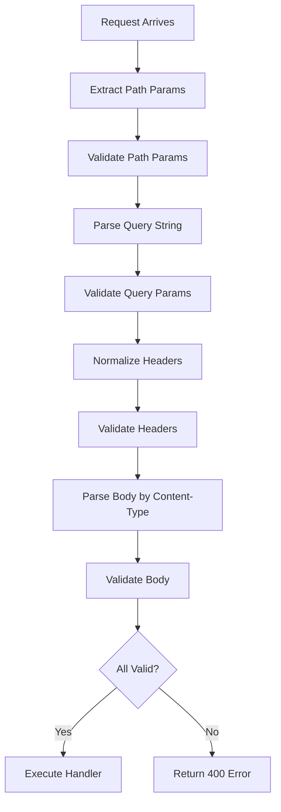

# Validation

`itty-spec` automatically validates all incoming requests against your contract schemas before your handlers run. This ensures type safety and data integrity.

## How Validation Works

Validation happens automatically in the middleware chain:



## Path Parameter Validation

Path parameters are extracted from the URL and validated against your schema.

### Automatic Extraction

When you use path patterns like `/users/:id`, parameters are automatically extracted as strings:

```ts
const contract = createContract({
  getUser: {
    path: "/users/:id",  // id is extracted as string
    method: "GET",
    responses: { /* ... */ },
  },
});

// In handler:
const { id } = request.validatedParams; // { id: string }
```

### Explicit Validation

For stricter validation, provide a `pathParams` schema:

```ts
const contract = createContract({
  getUser: {
    path: "/users/:id",
    method: "GET",
    pathParams: z.object({
      id: z.string().uuid(),  // Validates UUID format
    }),
    responses: { /* ... */ },
  },
});

// Validation fails if id is not a valid UUID
// GET /users/not-a-uuid → 400 Bad Request
```

### Validation Errors

Invalid path parameters return a 400 error:

```json
{
  "error": "Validation failed",
  "details": [
    {
      "path": ["id"],
      "message": "Invalid uuid"
    }
  ]
}
```

## Query Parameter Validation

Query parameters are parsed from the URL query string and validated.

### Basic Validation

```ts
const contract = createContract({
  searchUsers: {
    path: "/users",
    method: "GET",
    query: z.object({
      q: z.string().min(1),           // Required
      limit: z.number().min(1).max(100).default(10),
      offset: z.number().optional(),
    }),
    responses: { /* ... */ },
  },
});
```

### Type Coercion

Query parameters are strings in URLs, so you may need to transform them:

```ts
query: z.object({
  page: z.string()
    .transform(Number)
    .pipe(z.number().min(1)),
  limit: z.string()
    .transform(Number)
    .pipe(z.number().min(1).max(100)),
  active: z.enum(['true', 'false'])
    .transform(val => val === 'true'),
})
```

### Array Parameters

Handle array query parameters:

```ts
// ?tags=tag1&tags=tag2
query: z.object({
  tags: z.array(z.string()).optional(),
  ids: z.array(z.string().uuid()),
})
```

### Missing Parameters

- Required parameters without defaults: validation fails
- Optional parameters: set to `undefined`
- Parameters with defaults: use default value

## Header Validation

Headers are normalized to lowercase and validated against your schema.

### Basic Validation

```ts
const contract = createContract({
  createUser: {
    path: "/users",
    method: "POST",
    headers: z.object({
      authorization: z.string(),
      "content-type": z.literal("application/json"),
      "x-api-key": z.string(),
    }),
    responses: { /* ... */ },
  },
});
```

### Header Normalization

All header keys are normalized to lowercase:

```ts
// Schema definition
headers: z.object({
  "Authorization": z.string(),      // Capital A
  "X-API-Key": z.string(),         // Mixed case
})

// Runtime access (always lowercase)
request.validatedHeaders.get("authorization");  // ✅ Works
request.validatedHeaders.get("x-api-key");     // ✅ Works
```

### Comma-Separated Values

Some headers (like `Accept`) may contain comma-separated values. `itty-spec` handles this automatically:

```ts
headers: z.object({
  accept: z.union([
    z.literal("application/json"),
    z.literal("text/html"),
  ]),
})

// Request: Accept: application/json, text/html
// Validation tries each value until one matches
```

## Body Validation

Request bodies are validated based on the `Content-Type` header.

### Single Content Type

```ts
const contract = createContract({
  createUser: {
    path: "/users",
    method: "POST",
    requests: {
      "application/json": {
        body: z.object({
          name: z.string().min(1),
          email: z.string().email(),
        }),
      },
    },
    responses: { /* ... */ },
  },
});
```

### Multiple Content Types

When multiple content types are defined, validation uses the request's `Content-Type` header:

```ts
requests: {
  "application/json": {
    body: z.object({ name: z.string() }),
  },
  "application/xml": {
    body: z.string(),  // XML as string
  },
}

// Request with Content-Type: application/json
// → Validates against JSON schema
// Request with Content-Type: application/xml
// → Validates against XML schema
```

### Missing Content-Type

If `Content-Type` is required but missing, validation fails with 400:

```json
{
  "error": "Content-Type header is required"
}
```

### Unsupported Content-Type

If the `Content-Type` doesn't match any defined schema:

```json
{
  "error": "Unsupported Content-Type: text/plain. Supported types: application/json, application/xml"
}
```

### Empty Body

If no body is sent:
- Request body is set to `{}` (empty object)
- Validation passes if body schema is optional or has defaults

## Validation Error Handling

When validation fails, `itty-spec` automatically returns a 400 Bad Request response.

### Error Response Format

```json
{
  "error": "Validation failed",
  "details": [
    {
      "path": ["email"],
      "message": "Invalid email"
    },
    {
      "path": ["age"],
      "message": "Expected number, received string"
    }
  ]
}
```

### Custom Error Handling

You can customize error handling in middleware:

```ts
const router = createRouter({
  contract,
  handlers,
  before: [
    async (request) => {
      try {
        // Validation happens automatically
      } catch (error) {
        if (error instanceof Error && 'issues' in error) {
          // Custom validation error handling
          return new Response(
            JSON.stringify({
              customError: "Validation failed",
              issues: error.issues,
            }),
            { status: 400 }
          );
        }
        throw error;
      }
    },
  ],
});
```

## Custom Validation Patterns

### Conditional Validation

Use Zod's refinement for conditional validation:

```ts
const schema = z.object({
  type: z.enum(['email', 'phone']),
  value: z.string(),
}).refine(
  (data) => {
    if (data.type === 'email') {
      return z.string().email().safeParse(data.value).success;
    }
    return /^\d{10}$/.test(data.value);
  },
  { message: "Invalid value for type" }
);
```

### Async Validation

For database lookups or external API calls:

```ts
const schema = z.object({
  email: z.string().email(),
}).refine(
  async (data) => {
    const exists = await checkEmailExists(data.email);
    return !exists;
  },
  { message: "Email already exists" }
);
```

### Cross-Field Validation

Validate relationships between fields:

```ts
const schema = z.object({
  password: z.string().min(8),
  confirmPassword: z.string(),
}).refine(
  (data) => data.password === data.confirmPassword,
  {
    message: "Passwords don't match",
    path: ["confirmPassword"],
  }
);
```

## Validation Best Practices

### 1. Validate Early, Validate Often

Define schemas for all inputs to catch errors early:

```ts
// ✅ Good - validates everything
const contract = createContract({
  getUser: {
    path: "/users/:id",
    pathParams: z.object({ id: z.string().uuid() }),
    query: z.object({ include: z.array(z.string()).optional() }),
    headers: z.object({ authorization: z.string() }),
    responses: { /* ... */ },
  },
});
```

### 2. Use Descriptive Error Messages

```ts
// ✅ Good
z.string().email({ message: "Please provide a valid email address" })

// ❌ Bad
z.string().email()
```

### 3. Provide Sensible Defaults

```ts
query: z.object({
  page: z.number().min(1).default(1),
  limit: z.number().min(1).max(100).default(10),
  sort: z.enum(['asc', 'desc']).default('asc'),
})
```

### 4. Validate Path Parameters Explicitly

For non-string types, always provide explicit schemas:

```ts
// ✅ Good
pathParams: z.object({
  id: z.string().uuid(),
  version: z.string().transform(Number).pipe(z.number().int()),
})
```

### 5. Handle Optional Fields Properly

```ts
// ✅ Good - explicit optional
query: z.object({
  filter: z.string().optional(),
  limit: z.number().default(10),  // Has default, so always present
})
```

## Related Topics

- [Contracts](/guide/contracts) - Learn about defining validation schemas
- [Type Safety](/guide/type-safety) - Understand type inference from validation
- [Error Handling](/guide/error-handling) - Customize error responses

